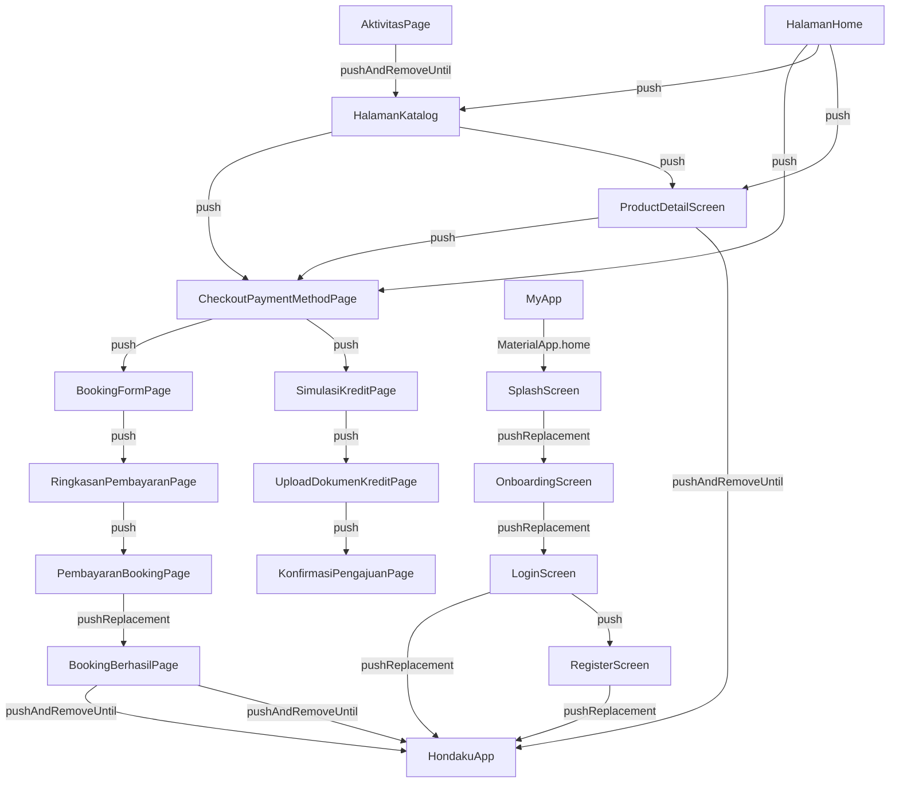

# Hondaku App Flow

Dokumen ini menjelaskan alur navigasi dan arah logika aplikasi berdasarkan struktur file.
Struktur file telah dikelompokkan ke dalam folder fungsional untuk memudahkan pencarian (*keywords*) dan audit kode.

## Struktur Direktori Utama (`lib/`)

- **`core/`**: File inti seperti `hondaku_app.dart` (shell navigasi bawah) dan `main.dart` (entry point).
- **`auth/`**: Flow masuk pengguna (Splash -> Onboarding -> Login -> Register).
- **`home/`**: Halaman utama (Home, Katalog, Detail Produk, Profil, Aktivitas).
- **`booking/`**: Flow pemesanan unit dan pembayaran (Pilih Metode Pembayaran -> Data Pemesan -> Ringkasan -> Pembayaran -> Berhasil).
- **`kredit/`**: Flow pengajuan kredit (Simulasi Kredit -> Upload Dokumen -> Konfirmasi).

## Flow Utama User

1. **Auth**: Splash Screen -> Onboarding -> Login/Register
2. **Utama**: Home / Katalog -> Pilih Motor -> Detail Motor -> Beli (Checkout)
   - *Logic*: Data `Motorcycle` diteruskan dari list utama ke Detail dan Checkout untuk memastikan konsistensi informasi unit.
3. **State Management**: Saat masuk ke Detail, aplikasi mengingat asal halaman (Home atau Katalog) untuk menjaga status aktif pada Bottom Navigation Bar.
4. **Checkout (Tunai)**: Pilih Tunai -> Isi Data Pemesan -> Ringkasan Pembayaran -> Instruksi Pembayaran -> Berhasil
5. **Checkout (Kredit)**: Pilih Kredit -> Simulasi Kredit -> Upload Dokumen -> Konfirmasi Pengajuan

---

<!-- AUTO_FLOW_START -->
## Auto-Generated Flow Map

> Bagian ini dihasilkan otomatis oleh `tool/sync_app_flow.dart`.
> Jangan edit manual di antara marker START/END karena akan ditimpa saat sinkronisasi.

**Generated at:** 2026-05-07 12:35:42.644837
**Detected nodes:** 18
**Detected transitions:** 23

### Detected Transitions

- AktivitasPage -> HalamanKatalog (pushAndRemoveUntil) [lib/home/aktivitas_page.dart:166]
- BookingBerhasilPage -> HondakuApp (pushAndRemoveUntil) [lib/booking/booking_berhasil_page.dart:184]
- BookingBerhasilPage -> HondakuApp (pushAndRemoveUntil) [lib/booking/booking_berhasil_page.dart:216]
- BookingFormPage -> RingkasanPembayaranPage (push) [lib/booking/booking_form_page.dart:768]
- CheckoutPaymentMethodPage -> BookingFormPage (push) [lib/booking/checkout_payment_method_page.dart:526]
- CheckoutPaymentMethodPage -> SimulasiKreditPage (push) [lib/booking/checkout_payment_method_page.dart:516]
- HalamanHome -> CheckoutPaymentMethodPage (push) [lib/home/home_page.dart:644]
- HalamanHome -> HalamanKatalog (push) [lib/home/home_page.dart:510]
- HalamanHome -> ProductDetailScreen (push) [lib/home/home_page.dart:615]
- HalamanKatalog -> CheckoutPaymentMethodPage (push) [lib/home/catalog_page.dart:525]
- HalamanKatalog -> ProductDetailScreen (push) [lib/home/catalog_page.dart:496]
- LoginScreen -> HondakuApp (pushReplacement) [lib/auth/login_screen.dart:237]
- LoginScreen -> RegisterScreen (push) [lib/auth/login_screen.dart:348]
- MyApp -> SplashScreen (MaterialApp.home) [lib/main.dart:20]
- OnboardingScreen -> LoginScreen (pushReplacement) [lib/auth/onboarding_screen.dart:45]
- PembayaranBookingPage -> BookingBerhasilPage (pushReplacement) [lib/booking/pembayaran_booking_page.dart:497]
- ProductDetailScreen -> CheckoutPaymentMethodPage (push) [lib/home/product_detail_screen.dart:652]
- ProductDetailScreen -> HondakuApp (pushAndRemoveUntil) [lib/home/product_detail_screen.dart:703]
- RegisterScreen -> HondakuApp (pushReplacement) [lib/auth/register_screen.dart:160]
- RingkasanPembayaranPage -> PembayaranBookingPage (push) [lib/booking/ringkasan_pembayaran_page.dart:441]
- SimulasiKreditPage -> UploadDokumenKreditPage (push) [lib/kredit/simulasi_kredit_page.dart:391]
- SplashScreen -> OnboardingScreen (pushReplacement) [lib/auth/splash_screen.dart:18]
- UploadDokumenKreditPage -> KonfirmasiPengajuanPage (push) [lib/kredit/upload_dokumen_kredit_page.dart:122]
<!-- AUTO_FLOW_END -->
