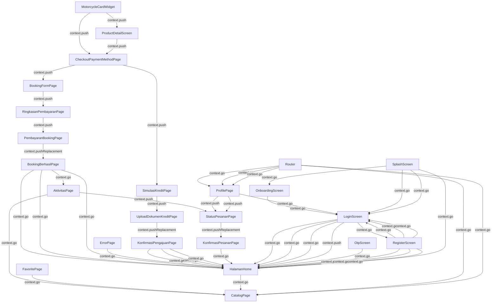

# Hondaku App Flow

Dokumen ini menjelaskan alur navigasi dan arah logika aplikasi berdasarkan struktur file.
Struktur file telah dikelompokkan ke dalam folder arsitektur bersih (*Clean Architecture*) untuk mempermudah pemeliharaan dan pelacakan dependensi.

## Struktur Direktori Utama (`lib/`)

- **`domain/models/`**: Representasi entitas bisnis bersih (seperti `UserProfile`, `AppSettings`, `PaymentMethodItem`, `Motorcycle`, dll) yang terpisah dari logika presentasi.
- **`data/`**: Data tiruan (*mock database*) dan `providers.dart` sebagai penghubung reaktif (Riverpod FutureProviders) untuk menyuplai data ke UI.
- **`l10n/`**: Berkas lokalisasi `.arb` untuk dukungan multibahasa (Indonesia/English).
- **`ui/core/`**: Router utama (`router.dart` dengan GoRouter), konfigurasi tema (`theme.dart`), shell navigasi bawah (`hondaku_app.dart`), dan widget global (`hondaku_avatar.dart`).
- **`ui/features/`**: Fitur modular yang terbagi menjadi komponen presentasi, halaman, dan view model:
  - **`auth/`**: Alur masuk pengguna (Splash -> Onboarding -> Login -> Register).
  - **`home/`**: Dasbor utama dengan pencarian, kategori motor, dan spanduk banner dinamis.
  - **`catalog/`**: Katalog pencarian motor dan halaman spesifikasi detail produk.
  - **`booking/`**: Alur checkout tunai (Pilih Pembayaran -> Isi Data -> Ringkasan -> Pembayaran -> Berhasil).
  - **`kredit/`**: Alur simulasi kredit dan unggah dokumen persyaratan leasing.
  - **`aktivitas/`**: Alur pelacakan status pesanan aktif dan daftar motor di garasi pengguna.
  - **`profile/`**: Dasbor pengguna beserta halaman pengaturan modular terpisah:
    - *Informasi Pribadi* (`informasi_pribadi_page.dart`)
    - *Metode Pembayaran* (`metode_pembayaran_page.dart` & `AddPaymentMethodSheet`)
    - *Bantuan & Dukungan* (`bantuan_dukungan_page.dart` & `SupportTicketSheet`)
    - *Pengaturan Preferensi* (`pengaturan_page.dart`)

## Flow Utama User

1. **Auth**: Splash Screen -> Onboarding -> Login/Register
2. **Utama**: Home / Katalog -> Pilih Motor -> Detail Motor -> Beli (Checkout)
   - *Logic*: Data `Motorcycle` diteruskan dari list utama ke Detail dan Checkout untuk memastikan konsistensi informasi unit.
3. **State Management**: Router GoRouter memanfaatkan `StatefulShellRoute.indexedStack` untuk menjaga state aktif Bottom Navigation Bar saat user menelusuri detail motor atau masuk ke halaman sub-profil.
4. **Checkout (Tunai)**: Pilih Tunai -> Isi Data Pemesan -> Ringkasan Pembayaran -> Instruksi Pembayaran -> Berhasil
5. **Checkout (Kredit)**: Pilih Kredit -> Simulasi Kredit -> Upload Dokumen -> Konfirmasi Pengajuan

---

<!-- AUTO_FLOW_START -->
## Auto-Generated Flow Map

> Bagian ini dihasilkan otomatis oleh `tool/sync_app_flow.dart`.
> Jangan edit manual di antara marker START/END karena akan ditimpa saat sinkronisasi.

**Generated at:** 2026-07-05 12:51:01.289888
**Detected nodes:** 24
**Detected transitions:** 49

### Detected Transitions

- AktivitasPage -> CatalogPage (context.go) [lib/ui/features/aktivitas/views/aktivitas_page.dart:281]
- AktivitasPage -> StatusPesananPage (context.push) [lib/ui/features/aktivitas/views/aktivitas_page.dart:332]
- BookingBerhasilPage -> AktivitasPage (context.go) [lib/ui/features/booking/views/booking_berhasil_page.dart:220]
- BookingBerhasilPage -> HalamanHome (context.go) [lib/ui/features/booking/views/booking_berhasil_page.dart:28]
- BookingBerhasilPage -> HalamanHome (context.go) [lib/ui/features/booking/views/booking_berhasil_page.dart:246]
- BookingBerhasilPage -> HalamanHome (context.go) [lib/ui/features/booking/views/booking_berhasil_page.dart:38]
- BookingFormPage -> RingkasanPembayaranPage (context.push) [lib/ui/features/booking/views/booking_form_page.dart:375]
- CheckoutPaymentMethodPage -> BookingFormPage (context.push) [lib/ui/features/booking/views/checkout_payment_method_page.dart:548]
- CheckoutPaymentMethodPage -> SimulasiKreditPage (context.push) [lib/ui/features/booking/views/checkout_payment_method_page.dart:544]
- ErrorPage -> HalamanHome (context.go) [lib/ui/core/error_page.dart:55]
- FavoritePage -> CatalogPage (context.go) [lib/ui/features/favorites/views/favorite_page.dart:64]
- HalamanHome -> CatalogPage (context.go) [lib/ui/features/home/views/home_page.dart:269]
- KonfirmasiPengajuanPage -> HalamanHome (context.go) [lib/ui/features/kredit/views/konfirmasi_pengajuan_page.dart:51]
- KonfirmasiPengajuanPage -> HalamanHome (context.go) [lib/ui/features/kredit/views/konfirmasi_pengajuan_page.dart:41]
- KonfirmasiPengajuanPage -> HalamanHome (context.go) [lib/ui/features/kredit/views/konfirmasi_pengajuan_page.dart:292]
- KonfirmasiPesananPage -> HalamanHome (context.go) [lib/ui/features/booking/views/konfirmasi_pesanan_page.dart:308]
- LoginScreen -> HalamanHome (context.go) [lib/ui/features/auth/views/login_screen.dart:179]
- LoginScreen -> HalamanHome (context.go) [lib/ui/features/auth/views/login_screen.dart:264]
- LoginScreen -> HalamanHome (context.go) [lib/ui/features/auth/views/login_screen.dart:285]
- LoginScreen -> HalamanHome (context.push) [lib/ui/features/auth/views/login_screen.dart:302]
- LoginScreen -> RegisterScreen (context.go) [lib/ui/features/auth/views/login_screen.dart:323]
- MotorcycleCardWidget -> CheckoutPaymentMethodPage (context.push) [lib/ui/core/widgets/motorcycle_card_widget.dart:211]
- MotorcycleCardWidget -> ProductDetailScreen (context.push) [lib/ui/core/widgets/motorcycle_card_widget.dart:183]
- OnboardingScreen -> LoginScreen (context.go) [lib/ui/features/auth/views/onboarding_screen.dart:49]
- OtpScreen -> HalamanHome (context.go) [lib/ui/features/auth/views/otp_screen.dart:121]
- PembayaranBookingPage -> BookingBerhasilPage (context.pushReplacement) [lib/ui/features/booking/views/pembayaran_booking_page.dart:616]
- ProductDetailScreen -> CheckoutPaymentMethodPage (context.push) [lib/ui/features/catalog/views/product_detail_screen.dart:415]
- ProfilePage -> LoginScreen (context.go) [lib/ui/features/profile/views/profile.dart:958]
- ProfilePage -> StatusPesananPage (context.push) [lib/ui/features/profile/views/profile.dart:250]
- ProfilePage -> StatusPesananPage (context.push) [lib/ui/features/profile/views/profile.dart:441]
- RegisterScreen -> HalamanHome (context.push) [lib/ui/features/auth/views/register_screen.dart:313]
- RegisterScreen -> HalamanHome (context.go) [lib/ui/features/auth/views/register_screen.dart:296]
- RegisterScreen -> HalamanHome (context.go) [lib/ui/features/auth/views/register_screen.dart:275]
- RegisterScreen -> LoginScreen (context.go) [lib/ui/features/auth/views/register_screen.dart:331]
- RegisterScreen -> LoginScreen (context.go) [lib/ui/features/auth/views/register_screen.dart:202]
- RegisterScreen -> LoginScreen (context.go) [lib/ui/features/auth/views/register_screen.dart:82]
- RingkasanPembayaranPage -> PembayaranBookingPage (context.push) [lib/ui/features/booking/views/ringkasan_pembayaran_page.dart:440]
- Router -> CatalogPage (context.go) [lib/ui/core/router.dart:104]
- Router -> CatalogPage (context.go) [lib/ui/core/router.dart:82]
- Router -> ProfilePage (context.go) [lib/ui/core/router.dart:103]
- Router -> ProfilePage (context.go) [lib/ui/core/router.dart:93]
- Router -> ProfilePage (context.go) [lib/ui/core/router.dart:83]
- SimulasiKreditPage -> UploadDokumenKreditPage (context.push) [lib/ui/features/kredit/views/simulasi_kredit_page.dart:416]
- SplashScreen -> HalamanHome (context.go) [lib/ui/features/auth/views/splash_screen.dart:56]
- SplashScreen -> LoginScreen (context.go) [lib/ui/features/auth/views/splash_screen.dart:62]
- SplashScreen -> LoginScreen (context.go) [lib/ui/features/auth/views/splash_screen.dart:58]
- SplashScreen -> OnboardingScreen (context.go) [lib/ui/features/auth/views/splash_screen.dart:65]
- StatusPesananPage -> KonfirmasiPesananPage (context.pushReplacement) [lib/ui/features/booking/views/status_pesanan_page.dart:52]
- UploadDokumenKreditPage -> KonfirmasiPengajuanPage (context.pushReplacement) [lib/ui/features/kredit/views/upload_dokumen_kredit_page.dart:149]
<!-- AUTO_FLOW_END -->
